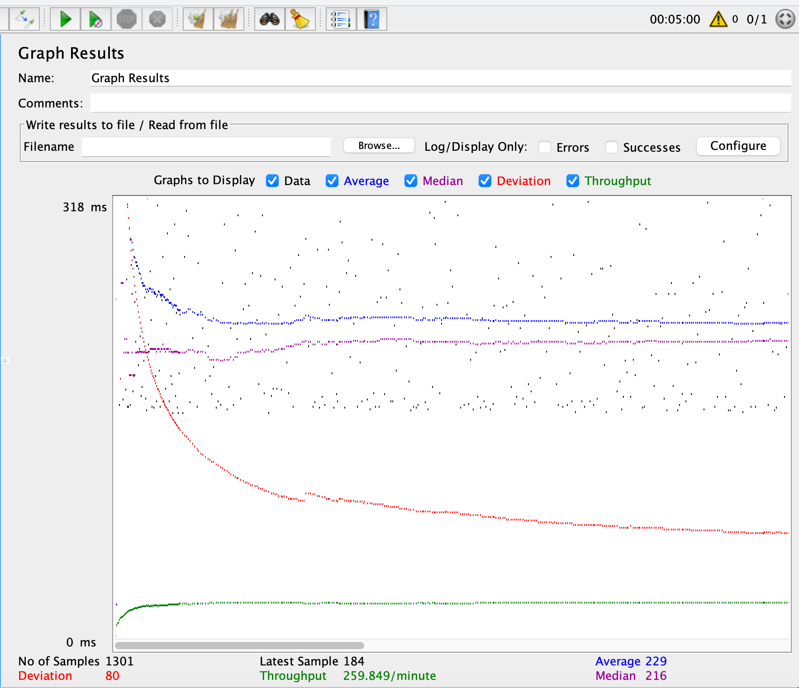
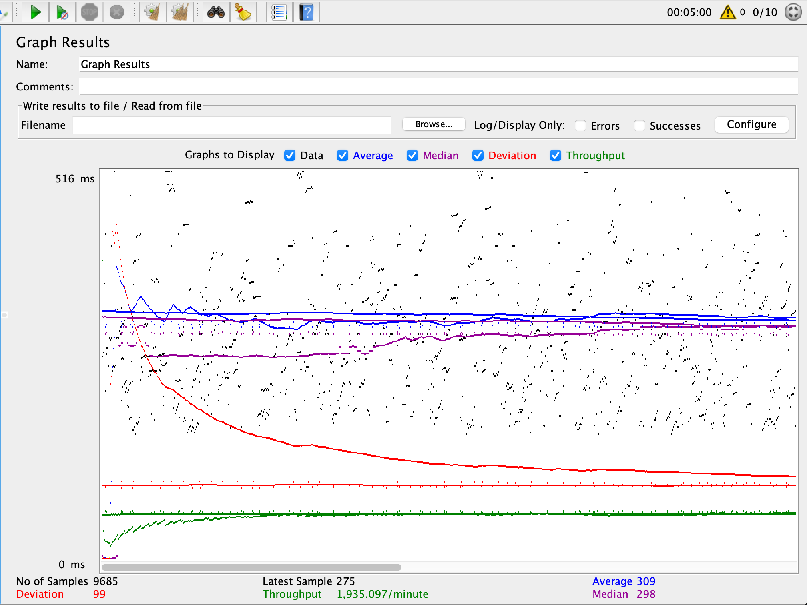
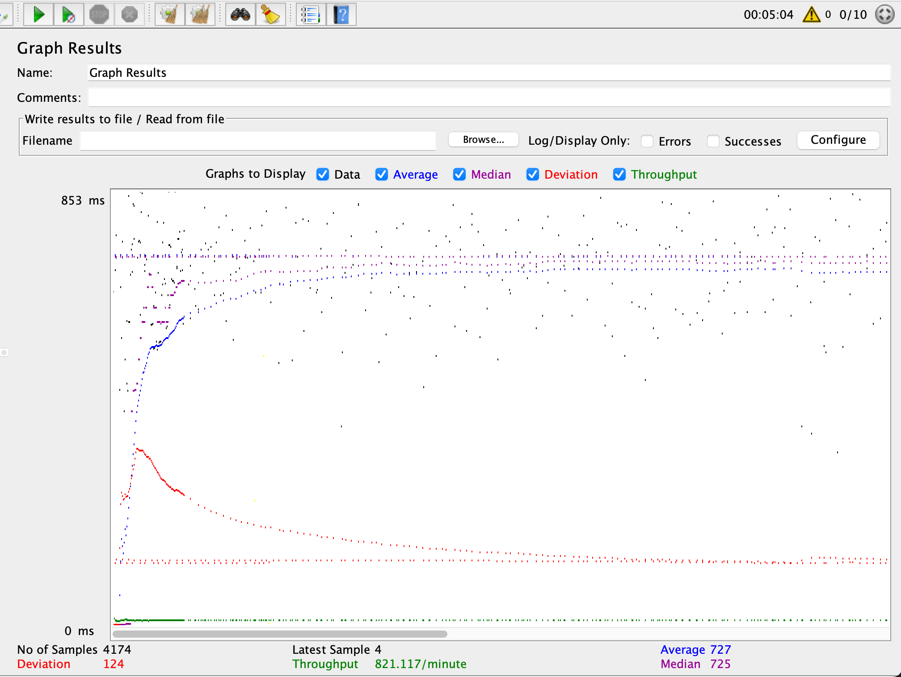
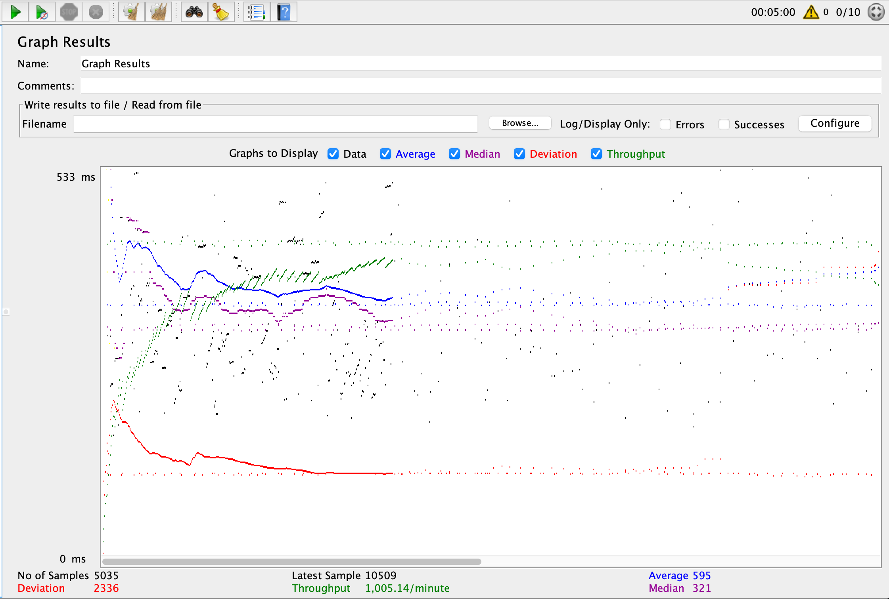
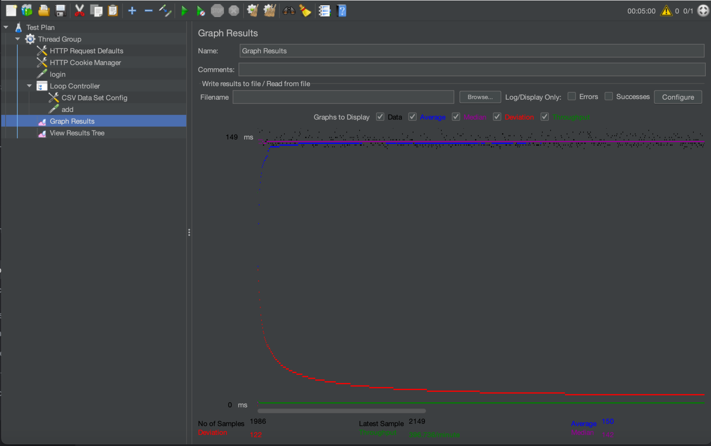
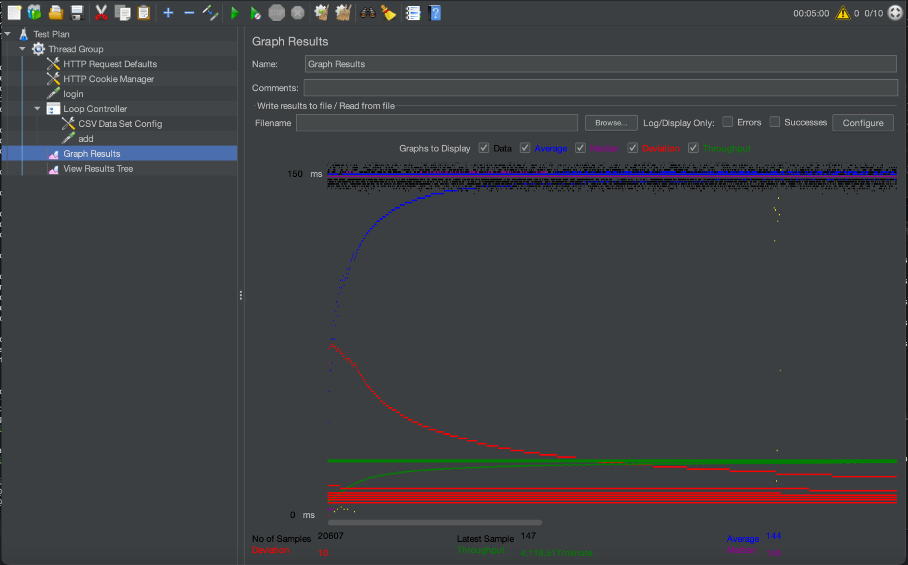
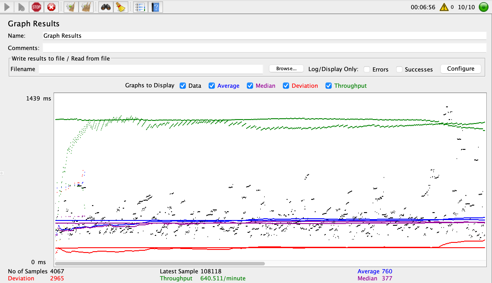

# CS 122B Team Ja # 

* Demo video URL of Project 1: https://www.youtube.com/watch?v=Tv-3f4Oi3nE
* Demo video URL of Project 2: https://youtu.be/yCj33M3dh3I
* Demo video URL of Project 3: https://youtu.be/WUGR2SZ7sR0 
* Demo video URL of Project 4: https://youtu.be/_oTlKKTIn9M

**Substring Matching Design**
We used the Like/ILike predicate in the MovieListServlet. We used it for constructing SQL queries for searching movies based on various criteria.
For example, we used LIKE to perform substring matching on the "title" and "director" columns.


**Prepared Statement Usage**
We used Prepared Statement in the following Servlets:
* MovieListServlet
* SingleMovieServlet
* SingleStarServlet
* AddMovieServlet
* AddStarServlet
* EmployeeLoginServlet
* GenreAllServlet
* LoginServlet
* MetadataServlet
* PaymentServlet

**Inconsistencies Report**
Duplicate Handling
  We've taking into consideration for multiple datatypes
* Movies - Check if movie with the same director, year, and title already exist in the database.
* Genres - Check if genre values is already created, if not create a new one.
* Stars - Compare current database to see if an actor with the same name and birthyear already exist
* Stars in Movies - Check if there's already a entry with the same linking for stars and movieID name
Inconsistencies in XML
* Stars with missing birthyears were assigned NULL values
* Stars with missing first and last names were assigned them deriving from their stage name
* Genres that didn't match key table found in doucmentation for code were set to Other
* Movies with missing director, title, year, or genres were not added
* Movies without stars are excluded
* Stars that didn't appear in any movies were excluded.
* Stars with missing stagenames (Key identifier) were excluded
* Movies with missing IDs were excluded.

**Performance Tuning**
1. Pregenerating UUIDs on Java-side
   * By reducing the amount of connections to the mysql server, we're able to reduce the runtime of the parser.
   * Instead of making a new sql connection, for every movie, star, and genre, id creation, they will already be created.
   * Possible caveat would be collisions.
     * Using the birthday problem forumla to detect the probability of collisions
       ```math
        p(n) \approx 1 - e^{-\frac{n^2}{2 \times M}}
       ```
     * With M = \$2^{40}\$ (the total number of possible UUIDs). -  40 bits due to varchar(10) characters.
     * N = 12,000 (the number of generated UUIDs) - seen in amount of films in main.xml file
     * The probality of crashing is 0.0055%
2. Multi-threading
   * By multithreading each mysql connection for all of the movies, stars, and stars_in_movies, there will faster runtime insertion, as each worker will have their own unique connection running in parallel.

## Report for Scaling Fabflix and Performance Tuning
- # General
    - #### Team#: Team Ja
    
    - #### Names:
      - Jason Wong
      - Jaehoon Song
    
    - #### Project 5 Video Demo Link:

    - #### Instruction of deployment:

    - #### Collaborations and Work Distribution:
      - Task 1: Jason
      - Task 2 & 3: Jaehoon
      - Task 4.1 & 4.2: Jason
      - Task 4: Jason and Jaehoon - Distributed the testing and logging 

- # Connection Pooling
    - #### Include the filename/path of all code/configuration files in GitHub of using JDBC Connection Pooling.
      - MovieListServlet
      - MovieSuggestion
      - SingleMovieServlet
      - SingleStarServlet
      - GenreAllServlet
      - AddMovieServlet
      - AddStarsServlet
      - EmployeeLoginServlet
      - PaymentServlet
      - LoginServlet
    -  #### Explain how Connection Pooling is utilized in the Fabflix code. 
     - All of the servlets use the same dataSource which encourages the servlets to reuse the data connections to the mysql database(s). This would reduce the amount of connections made and overall improve performance
    - #### Explain how Connection Pooling works with two backend SQL.
      - Connection pooling with two backend SQL databases involves setting up a pool of database connections that can be shared and reused by an application.
        - edit config, we check for retrieval, make requests, reuse connection, and load balancing.
        - All in all, connection pooling with two backend SQL databases enhances application performance by efficiently managing and reusing database connections, and load balancing ensures even distribution of requests among the databases.

- # Master/Slave
    - #### Include the filename/path of all code/configuration files in GitHub of routing queries to Master/Slave SQL.
      - Apache webserver2 (Tomcatpooling balancer and session sticky session)
        - filepath: /etc/apache2/sites-enabled/000-default.conf
 

    - #### How read/write requests were routed to Master/Slave SQL?
      - the load balancer can read/write into the master instance
      - the slave instance can only receive read
      - first made the server ids different for slave and master to differentiate between the two mysql database.
      - created replication user in master
      - in slave, we set up the replication by changing master host, master user, master password, master log file, master log pos to the same value as the one in the master instance.
    

- # JMeter TS/TJ Time Logs
    - #### Instructions of how to use the `log_processing.*` script to process the JMeter logs.
      - Install Python:
        - Create a virtual env or install andaconda/conda to create an enviroment to run a python file  
        - https://www.anaconda.com/download
        - https://www.python.org/downloads/
      - Add python to your computer path either
        - https://realpython.com/add-python-to-path/
      - If using conda/venv activate your enviroment
        - conda activate base
      - run the python file:
        - python log_processing.py
      - It will prompt you to put a log file and type or enter your log file
      - EX:
        - (base) jasonwong@Jasons-MacBook-Pro-3 fabflix % python log_processing.py
          Log file:/Users/jasonwong/Documents/CS122b/fabflix/logs/scaled-http-10-no-pooling.txt
          JDBC average time is: 39440405.61079615
          Servelt time is: 508793505.5644565
      - The results will be in nanoseconds.


- # JMeter TS/TJ Time Measurement Report

| **Single-instance Version Test Plan**          | **Graph Results Screenshot**                         | **Average Query Time(ms)** | **Average Search Servlet Time(ms)** | **Average JDBC Time(ms)** | **Analysis** |
|------------------------------------------------|------------------------------------------------------|----------------------------|-----------------------------------|---------------------------|--------------|
| Case 1: HTTP/1 thread                          |             | 229                        | 2.1949975322213801654                                  | 0.0016876                 |      Using 1 thread was faster than 10 threads      |
| Case 2: HTTP/10 threads                        |            | 309                        | 4.1478421355178829444                                | 0.0014308                 | 10 threads slowed down the time in general compared to one thread.           |
| Case 3: HTTPS/10 threads                       |           | 727                        | 2.036079069812229303                                | 0.00022805                | using HTTPS with 10 threads was the fastest. Using HTTPS itself was fast in general.           |
| Case 4: HTTP/10 threads/No connection pooling  |  | 595                        | 343.33206006965173174                                | 7.6253382254726362888                        | Connection Pooling Reduced a significant amount of Search Servlet Time           |

| **Scaled Version Test Plan**                   | **Graph Results Screenshot**                         | **Average Query Time(ms)** | **Average Search Servlet Time(ms)** | **Average JDBC Time(ms)** | **Analysis** |
|------------------------------------------------|------------------------------------------------------|----------------------------|-------------------------------------|---------------------------|--------------|
| Case 1: HTTP/1 thread                          |             | 150                        | 1.960823869521410634                                  | 0.0008266                        | faster than non-scaled in general         |
| Case 2: HTTP/10 threads                        |            | 144                        | 2.2099638043900071693                                  | 0.00029919                       | faster than non-scaled in general           |
| Case 3: HTTP/10 threads/No connection pooling  |  | 1107                         | 508.79350556445655229                                  | 39.440405610796155145                        | was slower for no connection pooling for scaled version           |


**Contributions**

Jason:
* CSS Styling
* Movielist/Index Servlet & html page
* Login, Search and Browse, Extend movie list, sorting, previous/next, extend single page.
* XML Parsing (task 6)
* full-text search and autocomplete

Jaehoon:
* Single Movie Servlet & html
* Single Star html
* CSS Styling, jump functionality, shopping cart, payment, and confirmation.
* added feature to add new movie and star (task 1-5)
* android app
