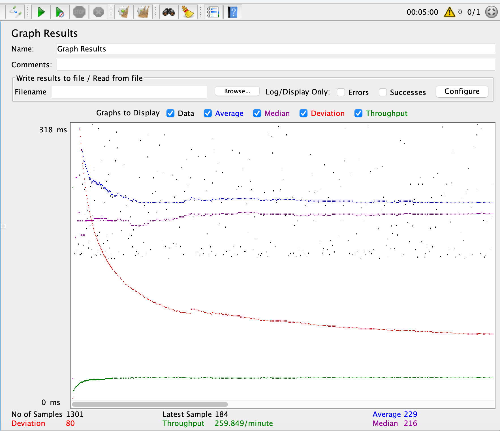
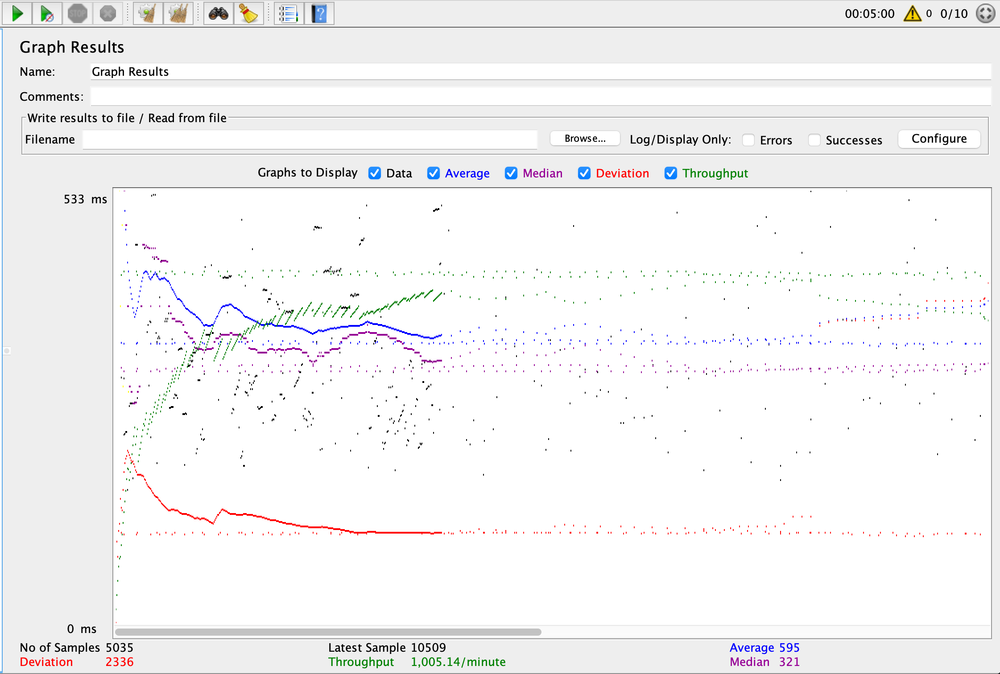
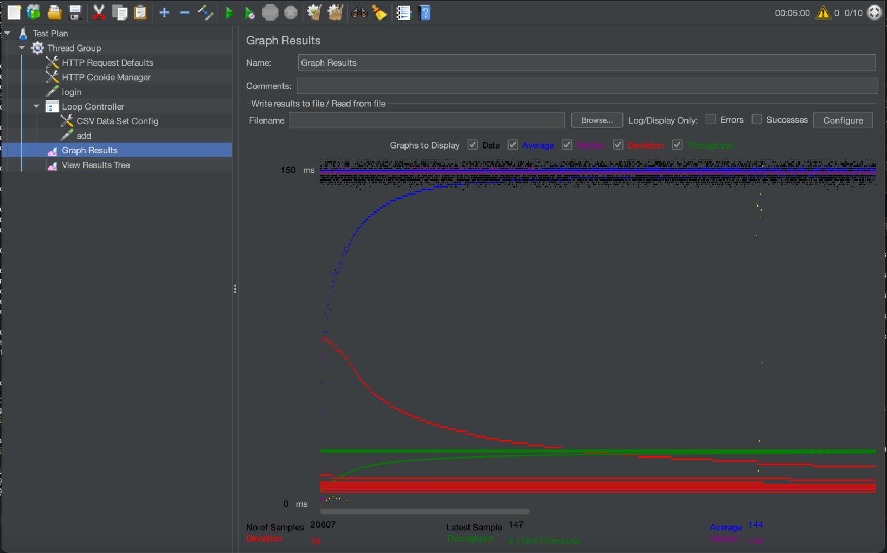

- # General
    - #### Team#: Team Ja
    
    - #### Names:
      - Jason Wong
      - Jaehoon Song
    
    - #### Project 5 Video Demo Link:

    - #### Instruction of deployment:

    - #### Collaborations and Work Distribution:
      - Task 1: Jason
      - Task 2 & 3: Jaehoon
      - Task 4.1 & 4.2: Jason
      - Task 4: Jason and Jaehoon - Distributed the testing and logging 

- # Connection Pooling
    - #### Include the filename/path of all code/configuration files in GitHub of using JDBC Connection Pooling.
      - MovieListServlet
      - MovieSuggestion
      - SingleMovieServlet
      - SingleStarServlet
      - GenreAllServlet
      - AddMovieServlet
      - AddStarsServlet
      - EmployeeLoginServlet
      - PaymentServlet
      - LoginServlet
    -  #### Explain how Connection Pooling is utilized in the Fabflix code. 
     - All of the servlets use the same dataSource which encourages the servlets to reuse the data connections to the mysql database(s). This would reduce the amount of connections made and overall improve performance
    - #### Explain how Connection Pooling works with two backend SQL.
      - Based on 

- # Master/Slave
    - #### Include the filename/path of all code/configuration files in GitHub of routing queries to Master/Slave SQL.

    - #### How read/write requests were routed to Master/Slave SQL?
    

- # JMeter TS/TJ Time Logs
    - #### Instructions of how to use the `log_processing.*` script to process the JMeter logs.
      - Install Python:
        - Create a virtual env or install andaconda/conda to create an enviroment to run a python file  
        - https://www.anaconda.com/download
        - https://www.python.org/downloads/
      - Add python to your computer path either
        - https://realpython.com/add-python-to-path/
      - If using conda/venv activate your enviroment
        - conda activate base
      - run the python file:
        - python log_processing.py
      - It will prompt you to put a log file and type or enter your log file
      - EX:
        - (base) jasonwong@Jasons-MacBook-Pro-3 fabflix % python log_processing.py
          Log file:/Users/jasonwong/Documents/CS122b/fabflix/logs/scaled-http-10-no-pooling.txt
          JDBC average time is: 39440405.61079615
          Servelt time is: 508793505.5644565
      - The results will be in nanoseconds.

- # JMeter TS/TJ Time Measurement Report

| **Single-instance Version Test Plan**          | **Graph Results Screenshot**                         | **Average Query Time(ms)** | **Average Search Servlet Time(ms)** | **Average JDBC Time(ms)** | **Analysis** |
|------------------------------------------------|------------------------------------------------------|----------------------------|-----------------------------------|---------------------------|--------------|
| Case 1: HTTP/1 thread                          |             | 229                        | 2.1949975322213801654                                  | 0.0016876                 | ??           |
| Case 2: HTTP/10 threads                        |            | 309                        | 4.1478421355178829444                                | 0.0014308                 | ??           |
| Case 3: HTTPS/10 threads                       |           | 727                        | 2.036079069812229303                                | 0.00022805                | ??           |
| Case 4: HTTP/10 threads/No connection pooling  |  | 595                        | 343.33206006965173174                                | 7.6253382254726362888                        | ??           |

| **Scaled Version Test Plan**                   | **Graph Results Screenshot**                         | **Average Query Time(ms)** | **Average Search Servlet Time(ms)** | **Average JDBC Time(ms)** | **Analysis** |
|------------------------------------------------|------------------------------------------------------|----------------------------|-------------------------------------|---------------------------|--------------|
| Case 1: HTTP/1 thread                          |             | 150                        | 1.960823869521410634                                  | 0.0008266                        | ??           |
| Case 2: HTTP/10 threads                        |            | 144                        | 2.2099638043900071693                                  | 0.00029919                       | ??           |
| Case 3: HTTP/10 threads/No connection pooling  |  | 1107                         | 508.79350556445655229                                  | 39.440405610796155145                        | ??           |
